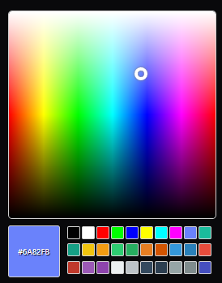

# easy-color-picker

Implement this simple and lightweight color picker specifically for Svelte without any dependencies, maintaining a small package footprint. Easily obtain the color value by utilizing the on:change event for the picker. Simply add it to any component. It will work well on mobile devices also.

# Install
```sh
npm install @bacherobot/easy-color-picker-svelte --save-dev
```

# Screenshot



# Sample
```html
<script lang="ts">
	import EasyColorPicker from '@bacherobot/easy-color-picker-svelte';
	const handleColor = (ev: CustomEvent) => {
		let color = ev.detail;
		console.log(color);
	};
</script>

<EasyColorPicker
	on:color={handleColorChange}
	colorPalletes={['#f57f17', '#00c853', '#00bfa5', '#2962ff']}
/>
```

# Demo
NA

# Props
### color: string
default: #0000ff
Bind the color value in hex format.

### colorPalettes: string[]
Set colors for quick access, can set max 4 colors into it.


# Events
on:color
Trigger with the color value `hex` format when color chnaged.

